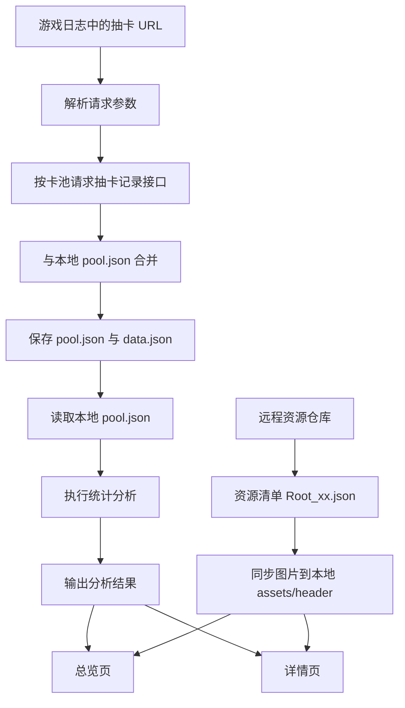

# 鸣潮抽卡分析功能实现规格

本文档从参考仓库 `leck995/WutheringWavesTool` 的实际实现中提取抽卡分析功能，但写法以**跨语言/跨技术栈复现**为目标。

目标是：只看本文档，不阅读参考项目 Java 源码，也能实现一个等价的抽卡分析功能。

本文档只覆盖抽卡分析相关内容，包括：

- 抽卡记录获取
- 本地缓存结构
- 新旧数据合并
- 抽卡统计算法
- 总览/详情展示所需数据
- 角色头像、武器图标资源来源

---

## 1. 功能边界

抽卡分析功能由两条链路组成：

1. **抽卡数据链路**
   - 从游戏日志或本地缓存中取得抽卡接口参数
   - 请求官方抽卡记录接口
   - 按玩家保存本地抽卡数据
   - 从本地数据执行统计分析

2. **展示资源链路**
   - 角色头像、武器图标不在抽卡分析页面实时请求
   - 应用启动或合适时机先从资源仓库同步图片到本地
   - 抽卡分析页面只按资源 ID 读取本地图片

整体架构是：



---

## 2. 必要数据结构

下面使用 TypeScript 风格描述字段，其他语言按等价结构实现即可。

### 2.1 抽卡记录 `GachaRecord`

一条抽卡记录至少需要这些字段：

```ts
interface GachaRecord {
  /** 卡池类型编号，字符串形式，例如 "1"、"2" */
  cardPoolType: string;

  /** 角色或武器资源 ID，用于识别条目和查找本地图片 */
  resourceId: number;

  /** 星级：5 / 4 / 3 */
  qualityLevel: 5 | 4 | 3;

  /** 资源类型，参考项目中保留但统计主逻辑不依赖 */
  resourceType?: string;

  /** 角色或武器名称 */
  name: string;

  /** 接口返回字段，参考项目统计主逻辑不依赖 */
  count?: number;

  /** 抽取时间，格式为 yyyy-MM-dd HH:mm:ss */
  time: string;
}
```

关键约定：

- 列表顺序默认是**最新记录在前，最旧记录在后**。
- 统计逻辑依赖 `qualityLevel`、`resourceId`、`name`、`time`。
- 图片展示依赖 `resourceId`。

### 2.2 本地卡池文件 `PoolFile`

本地 `pool.json` 是一个按卡池名称分组的对象：

```ts
type PoolFile = Record<string, GachaRecord[]>;
```

示例：

```json
{
  "角色活动唤取": [
    {
      "cardPoolType": "1",
      "resourceId": 1104,
      "qualityLevel": 5,
      "resourceType": "角色",
      "name": "示例角色",
      "count": 1,
      "time": "2026-07-06 12:30:00"
    }
  ],
  "武器活动唤取": []
}
```

> 卡池名称可以本地化，但必须保持稳定，因为它会作为本地 JSON 的 key 和展示标题。

### 2.3 请求参数缓存 `RequestParams`

本地 `data.json` 保存后续刷新需要复用的请求参数。

```ts
type RequestParams = Record<string, string>;
```

必须包含：

- `playerId`：玩家 ID，用于判断本地目录和服务器接口
- `cardPoolType`：请求时会被逐池覆盖
- 其他从游戏日志抽卡 URL 中解析出的官方接口参数

### 2.4 分析结果 `AnalysisData`

每个卡池输出一个分析结果：

```ts
interface AnalysisData {
  /** 该卡池是否没有数据 */
  isEmpty: boolean;

  /** 卡池展示名 */
  poolName: string;

  /** 总抽数 */
  totalCount: number;

  /** 当前距离最近 5 星已经过去多少抽 */
  noUpSsrCount: number;

  /** 当前距离最近 4 星或更高品质出货已经过去多少抽 */
  noUpSrCount: number;

  /** 参考项目保留字段；主流程未实际计算，可置 0 */
  noUpRCount: number;

  /** 5 星、4 星、3 星数量 */
  ssrCount: number;
  srCount: number;
  rCount: number;

  /** 5 星出货抽数平均/最小/最大 */
  ssrAvg: number;
  ssrMin: number;
  ssrMax: number;

  /** 4 星出货抽数平均/最小/最大 */
  srAvg: number;
  srMin: number;
  srMax: number;

  /** 参考项目定义了 3 星统计字段，但主分析流程未调用 3 星分段分析，可置 0 */
  rAvg: number;
  rMin: number;
  rMax: number;

  /** 时间范围，日期部分，格式 yyyy-MM-dd */
  startDate?: string;
  endDate?: string;

  /** 出货明细 */
  ssrDataList: HitData[];
  srDataList: HitData[];
  rDataList: HitData[];
}
```

### 2.5 出货明细 `HitData`

参考项目里 5 星和 4 星都复用同一种明细结构：

```ts
interface HitData {
  /** resourceId，用于查图片 assets/header/{id}.png */
  id: number;

  /** 角色或武器名称 */
  name: string;

  /** 本次出货距离上一次同星级出货的抽数区间长度 */
  count: number;

  /** 是否限定。5 星使用常驻 ID 列表判断，4 星固定 false */
  event: boolean;

  /** 出货时间，格式 yyyy-MM-dd HH:mm:ss */
  date: string;
}
```

---

## 3. 本地文件布局

按玩家 ID 分目录保存：

```text
data/
  {playerId}/
    pool.json      # 所有卡池抽卡记录，按卡池名称分组
    data.json      # 刷新抽卡记录所需请求参数
    pool.json.bak  # 每天最多保留一次旧 pool.json 备份
```

图片资源保存到：

```text
assets/
  header/
    {resourceId}.png
  data/
    Root_{language}.json
```

说明：

- `pool.json` 是抽卡分析的主数据源。
- `data.json` 是刷新接口的参数缓存。
- `assets/header/{resourceId}.png` 是头像/武器图标读取路径。

---

## 4. 抽卡接口请求

### 4.1 请求地址

按 `playerId` 判断服务器：

```text
如果 playerId 以 "1" 开头：
  https://gmserver-api.aki-game2.com/gacha/record/query
否则：
  https://gmserver-api.aki-game2.net/gacha/record/query
```

### 4.2 请求方法

```text
POST application/json
```

请求体：

```json
{
  "playerId": "...",
  "recordId": "...",
  "cardPoolId": "...",
  "cardPoolType": "1",
  "serverId": "...",
  "languageCode": "..."
}
```

实际请求体还需要带上从游戏日志抽卡 URL 解析出的其他参数。参考实现的关键点不是参数名本身，而是：

- 首次获取时从游戏日志中的抽卡 URL 解析完整参数
- 后续刷新时复用本地 `data.json`
- 每次请求某个卡池前覆盖 `cardPoolType`

参考项目从日志 URL 的 query 中提取参数时使用下面的字段映射：

| URL query 参数 | 请求体字段     |
| -------------- | -------------- |
| `player_id`    | `playerId`     |
| `record_id`    | `recordId`     |
| `resources_id` | `cardPoolId`   |
| `gacha_type`   | `cardPoolType` |
| `svr_id`       | `serverId`     |
| `lang`         | `languageCode` |

参考项目没有显式追加 `pageNum` / `pageSize` 字段；如果后续接口版本需要分页，应在接口验证后再扩展。

### 4.3 卡池请求策略

本地维护一份固定卡池列表，按顺序映射到 `cardPoolType`。

参考项目语言包中的实际卡池名称如下：

```ts
const cardPools = [
  { name: "角色活动唤取", type: "1" },
  { name: "武器活动唤取", type: "2" },
  { name: "角色常驻唤取", type: "3" },
  { name: "武器常驻唤取", type: "4" },
  { name: "新手唤取", type: "5" },
  { name: "新手自选唤取", type: "6" },
  { name: "新手自选唤取（感恩定向唤取）", type: "7" },
  { name: "角色新旅唤取", type: "8" },
  { name: "武器新旅唤取", type: "9" },
  { name: "角色联动唤取", type: "10" },
  { name: "武器联动唤取", type: "11" },
];
```

> 名称可根据实际项目本地化调整；重要的是顺序和 `cardPoolType` 对应关系稳定。参考项目总览页主要使用前 4 个池子：角色活动、武器活动、角色常驻、武器常驻。

### 4.4 单池请求伪代码

```ts
async function queryPool(
  baseParams: RequestParams,
  cardPoolType: string,
): Promise<GachaRecord[]> {
  const body = {
    ...baseParams,
    cardPoolType,
  };

  const response = await postJson(getRequestUrl(baseParams.playerId), body);

  if (response.httpStatus !== 200) {
    throw new Error("抽卡接口请求失败");
  }

  if (response.body.code !== 0) {
    throw new Error("抽卡接口返回业务错误");
  }

  return response.body.data as GachaRecord[];
}
```

---

## 5. 首次获取与刷新流程

### 5.1 首次获取

首次获取流程：

1. 用户配置游戏根目录
2. 找到游戏日志文件
3. 从日志中查找抽卡记录页面 URL
4. 从 URL query 中解析请求参数
5. 对每个卡池请求数据
6. 和本地旧数据合并
7. 保存 `pool.json` 和 `data.json`

伪代码：

```ts
async function firstLoad(gameRootDir: string): Promise<void> {
  const logFile = findGameLogFile(gameRootDir);
  const gachaUrl = extractGachaUrlFromLog(logFile);
  const params = parseQueryParams(gachaUrl);
  const poolFile = await fetchAndMergeAllPools(params);
  savePlayerData(params.playerId, params, poolFile);
}
```

错误处理建议：

- 未配置游戏目录：提示用户设置游戏目录
- 日志文件不存在：提示日志路径错误或游戏未生成日志
- 日志中找不到抽卡 URL：提示用户先在游戏内打开抽卡记录页面

参考项目从日志中匹配抽卡 URL 的规则：

```regex
https.*/aki/gacha/index.html#/record[?=&\w\-]+
```

实现要求：

- 逐行扫描日志文件
- 收集所有匹配到的抽卡记录 URL
- 使用最后一个匹配项作为最新可用 URL
- 从 `?` 后按 `&` 分割 query 参数，再按上一节的字段映射转换为请求体字段

### 5.2 后续刷新

后续刷新不再读日志，直接使用 `data/{playerId}/data.json`：

```ts
async function refresh(playerId: string): Promise<void> {
  const params = readJson<RequestParams>(`data/${playerId}/data.json`);
  const poolFile = await fetchAndMergeAllPools(params);
  savePlayerData(playerId, params, poolFile);
}
```

---

## 6. 新旧数据合并算法

### 6.1 输入输出

输入：

- `oldData`：本地旧记录，最新在前
- `newData`：接口新记录，最新在前

输出：

- 合并后的记录，仍保持最新在前

### 6.2 合并规则

参考实现不是按唯一 ID 去重，而是按时间拼接。

规则：

1. 如果 `newData` 为空，返回 `oldData`
2. 如果 `oldData` 为空，返回 `newData`
3. 取 `newData` 最后一条记录的时间，记为 `newLastTime`
4. 从 `oldData` 开头向后找：
   - 如果某条旧记录时间早于 `newLastTime`，把这一条及其之后的旧记录拼到 `newData` 后面
   - 如果某条旧记录时间等于 `newLastTime`，继续向后跳过所有同时间记录，直到遇到更早记录，再把更早记录及之后部分拼到 `newData` 后面
5. 如果旧数据中没有更早记录，返回 `newData`

### 6.3 伪代码

```ts
function mergeRecords(
  oldData: GachaRecord[],
  newData: GachaRecord[],
): GachaRecord[] {
  if (newData.length === 0) return oldData;
  if (oldData.length === 0) return newData;

  const newLastTime = parseTime(newData[newData.length - 1].time);
  const result = [...newData];

  for (let i = 0; i < oldData.length; i++) {
    const oldTime = parseTime(oldData[i].time);

    if (oldTime < newLastTime) {
      result.push(...oldData.slice(i));
      break;
    }

    if (oldTime.getTime() === newLastTime.getTime()) {
      for (let j = i; j < oldData.length; j++) {
        const oldTime2 = parseTime(oldData[j].time);
        if (oldTime2 < newLastTime) {
          result.push(...oldData.slice(j));
          break;
        }
      }
      break;
    }
  }

  return result;
}
```

注意：

- 这是参考项目的真实策略。
- 它依赖时间顺序，不是严格主键去重。
- 如果同一秒存在多条记录，它会把 `newLastTime` 这一秒的旧记录全部视为已被新数据覆盖。

---

## 7. 保存策略

保存时写两个文件：

```ts
function savePlayerData(
  playerId: string,
  params: RequestParams,
  poolFile: PoolFile,
): void {
  const dir = `data/${playerId}`;
  ensureDir(dir);

  const poolPath = `${dir}/pool.json`;
  if (exists(poolPath) && lastModifiedBeforeToday(poolPath)) {
    rename(poolPath, `${dir}/pool.json.bak`, { overwrite: true });
  }

  writeJson(poolPath, poolFile, { pretty: true });
  writeJson(`${dir}/data.json`, params, { pretty: true });
}
```

备份规则：

- `pool.json` 如果存在且最后修改时间早于今天 00:00，则备份为 `pool.json.bak`
- 如果今天已经写过，则不再重复备份
- 只保留一个 `.bak`，不是多版本备份

---

## 8. 抽卡分析算法

### 8.1 输入输出

输入：

- 一个玩家的 `pool.json`
- `skipFirstSSR: boolean`
- `baseSsrIds: Set<number | string>`：常驻 5 星资源 ID 集合

输出：

- `AnalysisData[]`，每个卡池一个结果

### 8.2 总控伪代码

```ts
function analyzePoolFile(
  poolFile: PoolFile,
  skipFirstSSR: boolean,
  baseSsrIds: Set<string>,
): AnalysisData[] {
  const results: AnalysisData[] = [];

  for (const [poolName, records] of Object.entries(poolFile)) {
    results.push(analyzeOnePool(poolName, records, skipFirstSSR, baseSsrIds));
  }

  return results;
}
```

### 8.3 单池分析伪代码

```ts
function analyzeOnePool(
  poolName: string,
  inputRecords: GachaRecord[],
  skipFirstSSR: boolean,
  baseSsrIds: Set<string>,
): AnalysisData {
  let records = [...inputRecords];

  if (skipFirstSSR) {
    records = dropOldestSsrAndOlderRecords(records);
  }

  const result = createEmptyAnalysisData(poolName);
  result.totalCount = records.length;

  if (records.length === 0) {
    result.isEmpty = true;
    return result;
  }

  result.isEmpty = false;
  result.startDate = datePart(records[records.length - 1].time);
  result.endDate = datePart(records[0].time);

  const ssrIndexes = findIndexes(records, 5);
  const srIndexes = findIndexes(records, 4);
  const rIndexes = findIndexes(records, 3);

  result.ssrCount = ssrIndexes.length;
  result.srCount = srIndexes.length;
  result.rCount = rIndexes.length;

  fillNoUpCounts(result, records, ssrIndexes, srIndexes);
  fillRankStats(result, records, ssrIndexes, 5, baseSsrIds);
  fillRankStats(result, records, srIndexes, 4, baseSsrIds);

  // 参考项目定义了 3 星统计结构，但主流程没有调用 3 星分段统计。
  result.rAvg = 0;
  result.rMin = 0;
  result.rMax = 0;
  result.rDataList = [];

  return result;
}
```

---

## 9. 具体统计规则

### 9.1 跳过最早 5 星

如果 `skipFirstSSR = true`：

- 从列表尾部向前查找第一个 5 星
- 找到后，丢弃该 5 星以及它之后更旧的记录
- 只保留它之前更新的记录

伪代码：

```ts
function dropOldestSsrAndOlderRecords(records: GachaRecord[]): GachaRecord[] {
  for (let i = records.length - 1; i >= 0; i--) {
    if (records[i].qualityLevel === 5) {
      return records.slice(0, i);
    }
  }
  return records;
}
```

### 9.2 时间范围

记录默认最新在前：

```ts
startDate = datePart(records[records.length - 1].time); // 最旧记录日期
endDate = datePart(records[0].time); // 最新记录日期
```

`datePart("2026-07-06 12:30:00") = "2026-07-06"`。

### 9.3 星级数量

```ts
ssrIndexes = 所有 qualityLevel == 5 的索引
srIndexes  = 所有 qualityLevel == 4 的索引
rIndexes   = 所有 qualityLevel == 3 的索引

ssrCount = ssrIndexes.length
srCount = srIndexes.length
rCount = rIndexes.length
```

### 9.4 当前已垫次数

5 星已垫：

```ts
noUpSsrCount = ssrIndexes.length > 0 ? ssrIndexes[0] : records.length;
```

解释：

- 索引 `0` 是最新一抽
- 最近一次 5 星的索引就是距离现在已经过去的抽数
- 没有 5 星时，等于总抽数

4 星已垫：

```ts
function calcNoUpSrCount(
  total: number,
  ssrIndexes: number[],
  srIndexes: number[],
): number {
  const nearestSsrIndex = ssrIndexes.length > 0 ? ssrIndexes[0] : total;

  if (srIndexes.length === 0) {
    return nearestSsrIndex;
  }

  const nearestSrIndex = srIndexes[0];
  return nearestSrIndex < nearestSsrIndex ? nearestSrIndex : nearestSsrIndex;
}
```

解释：

- 4 星保底视为会被 4 星或更高品质出货重置
- 所以取最近的 4 星和最近的 5 星中更靠近当前的一次

### 9.5 5 星出货统计

对于每一个 5 星索引：

- 当前 5 星索引为 `index`
- 下一个更旧的 5 星索引为 `nextIndex`
- 如果存在 `nextIndex`，本次出货抽数为 `nextIndex - index`
- 如果不存在，说明这是当前分析区间最旧的 5 星，本次出货抽数为 `records.length - index`

伪代码：

```ts
function buildHitDataForRank(
  records: GachaRecord[],
  indexes: number[],
  rank: 5 | 4,
  baseSsrIds: Set<string>,
): HitData[] {
  const list: HitData[] = [];

  for (let i = 0; i < indexes.length; i++) {
    const index = indexes[i];
    const nextIndex = indexes[i + 1];
    const count =
      nextIndex === undefined ? records.length - index : nextIndex - index;

    const record = records[index];

    list.push({
      id: record.resourceId,
      name: record.name,
      count,
      event: rank === 5 ? !baseSsrIds.has(String(record.resourceId)) : false,
      date: record.time,
    });
  }

  return list;
}
```

5 星统计值：

```ts
ssrDataList = buildHitDataForRank(records, ssrIndexes, 5, baseSsrIds);
ssrAvg = average(ssrDataList.map((x) => x.count));
ssrMin = min(ssrDataList.map((x) => x.count));
ssrMax = max(ssrDataList.map((x) => x.count));
```

如果没有 5 星：

```ts
ssrDataList = [];
ssrAvg = 0;
ssrMin = 0;
ssrMax = 0;
```

### 9.6 4 星出货统计

4 星统计与 5 星一致，只是：

- 使用 `srIndexes`
- `event` 固定为 `false`
- 没有 4 星时，`srAvg/srMin/srMax = 0`

```ts
srDataList = buildHitDataForRank(records, srIndexes, 4, baseSsrIds);
srAvg = average(srDataList.map((x) => x.count));
srMin = min(srDataList.map((x) => x.count));
srMax = max(srDataList.map((x) => x.count));
```

### 9.7 限定 5 星识别

参考实现不依赖接口字段判断限定，而是维护一个本地“常驻 5 星资源 ID 集合”：

```ts
event = !baseSsrIds.has(String(resourceId));
```

参考项目语言包中的默认集合为：

```ts
const baseSsrIds = new Set([
  "1104",
  "1203",
  "1301",
  "1503",
  "1405",
  "21010015",
  "21020015",
  "21030015",
  "21040015",
  "21050015",
]);
```

含义：

- 在 `baseSsrIds` 中：常驻，不是限定
- 不在 `baseSsrIds` 中：视为限定

实现时必须自行维护 `baseSsrIds`，并随游戏版本更新。

### 9.8 限定 5 星平均抽数

详情页显示“限定平均抽数”时，参考实现的计算方式是：

```ts
const sum = ssrDataList.reduce((acc, item) => acc + item.count, 0);
const eventCount = ssrDataList.filter((item) => item.event).length;
const eventAvg = eventCount === 0 ? null : sum / eventCount;
```

注意：这里的分子是**所有 5 星 count 的总和**，分母是**限定 5 星数量**。这就是参考项目的真实口径。

如果想改成更常见的“仅限定 5 星 count 平均”，应明确标注为与参考项目不同。

### 9.9 抽卡成本

详情页中总消耗按每抽 160 计算：

```ts
totalCost = totalCount * 160;
```

---

## 10. 展示数据建议

### 10.1 总览页

参考项目总览页主要展示前 4 个卡池：

1. 角色活动池
2. 武器活动池
3. 角色常驻池
4. 武器常驻池

每个卡池展示：

- 卡池名
- 总抽数
- 时间范围：`startDate - endDate`
- 当前 5 星已垫：`noUpSsrCount`
- 当前 4 星已垫：`noUpSrCount`
- 5 星数量和占比：`ssrCount / totalCount`
- 4 星数量和占比：`srCount / totalCount`
- 5 星平均抽数：`ssrAvg`
- 5 星历史列表：`ssrDataList`

### 10.2 详情页

详情页按单个卡池展示：

- 总抽数：`totalCount`
- 总消耗：`totalCount * 160`
- 当前 5 星已垫：`noUpSsrCount`
- 5/4/3 星数量
- 5/4/3 星占比
- 5 星平均、最小、最大抽数
- 限定 5 星平均抽数
- 5 星历史列表
- 5/4/3 星占比饼图

---

## 11. 图片资源链路

### 11.1 展示阶段

抽卡分析页面不要实时拉远程图片，而是按资源 ID 读取本地文件：

```text
assets/header/{resourceId}.png
```

示例：

```ts
function getHeaderImagePath(resourceId: number): string | null {
  const path = `assets/header/${resourceId}.png`;
  return exists(path) ? path : null;
}
```

资源不存在时：

- 返回空路径或占位图
- 不在列表渲染中发起远程下载

### 11.2 资源同步来源

参考实现使用独立资源仓库同步本地资源。

远程源：

```text
GitHub: https://raw.githubusercontent.com/leck995/WutheringWavesToolResources/main/
Gitee:  https://gitee.com/tealc/WutheringWavesToolResources/raw/main/
```

入口清单：

```text
data/Root_{language}.json
```

本地缓存：

```text
assets/data/Root_{language}.json
```

同步流程：

1. 根据语言选择 `Root_{language}.json`
2. 下载远程 Root 清单
3. 与本地 Root 清单比较版本
4. 如果版本不同或上次同步失败，遍历清单中的资源文件
5. 对每个资源：
   - 检查本地目标文件是否存在
   - 计算本地文件 MD5
   - 如果 MD5 与清单不一致，则下载
   - 下载后再次校验 MD5
6. 图片最终落到 `assets/header/{resourceId}.png` 等路径

资源清单可抽象为：

```ts
interface ResourceRoot {
  version: string;
  resources: Record<string, ResourceItem[]>;
}

interface ResourceItem {
  name: string;
  filePath: string; // 远程仓库中的路径
  aimPath: string; // 本地保存路径，例如 assets/header/1104.png
  md5: string;
}
```

---

## 12. 最小可实现模块拆分

如果用任意语言重新实现，可按下面模块拆：

```text
gacha/
  log-parser        # 从游戏日志提取抽卡 URL 和参数
  api-client        # 请求抽卡记录接口
  storage           # 读写 data/{playerId}/pool.json 和 data.json
  merger            # 合并新旧抽卡记录
  analyzer          # 计算 AnalysisData
  resources-sync    # 同步 assets/header 图片资源
  ui-adapter        # 把 AnalysisData 转成前端展示模型
```

其中最核心的是：

- `api-client`
- `storage`
- `merger`
- `analyzer`
- `resources-sync`

---

## 13. 最小实现顺序

建议按这个顺序做：

1. 定义 `GachaRecord`、`PoolFile`、`AnalysisData`、`HitData`
2. 实现读取/写入 `pool.json`
3. 先用手工准备的 `pool.json` 实现 `analyzePoolFile`
4. 实现总览/详情展示
5. 实现新旧记录合并 `mergeRecords`
6. 实现 `data.json` 参数缓存
7. 实现抽卡接口请求和刷新
8. 实现游戏日志 URL 提取
9. 实现资源同步和本地图片读取

这样可以先完成离线分析，再接入网络获取。

---

## 14. 必须注意的复现细节

1. **抽卡记录顺序**必须保持最新在前，否则已垫次数和区间统计都会错。
2. **合并策略按时间拼接**，不是按唯一 ID 去重。
3. **5 星限定判断依赖本地常驻 ID 集合**，不是接口字段。
4. **4 星已垫会被 5 星重置**，所以取最近 4 星和最近 5 星中更近的一次。
5. **3 星分段统计字段存在，但参考主流程未实际填充**，可先置 0。
6. **图片不应在列表渲染时远程加载**，应预同步到本地。
7. **`data.json` 很重要**，没有它就只能重新从游戏日志找抽卡 URL。
8. **资源 ID 同时用于统计条目识别和图片路径映射**。

---

## 15. 溯源文件清单

以下 Java 文件只是本文档结论的来源，不是实现时必须阅读的依赖：

- `CardPoolRequestTask.java`：抽卡接口请求、新旧数据合并、本地保存
- `CardPoolAnalysisTask.java`：抽卡统计主算法
- `CardInfo.java`：抽卡记录字段
- `AnalysisData.java`：分析结果字段
- `SsrData.java`：出货明细字段
- `CardCommonAnalysisViewModel.java`：总览页展示字段
- `CardDetailAnalysisViewModel.java`：详情页展示字段
- `CardCommonAnalysisView.java`：总览页头像展示调用
- `CardDetailAnalysisView.java`：详情页头像展示调用
- `LocalResourcesManager.java`：本地图片路径规则
- `MainViewModel.java`：应用启动时触发资源同步
- `ResourcesSyncTask.java`：远程资源仓库同步逻辑
